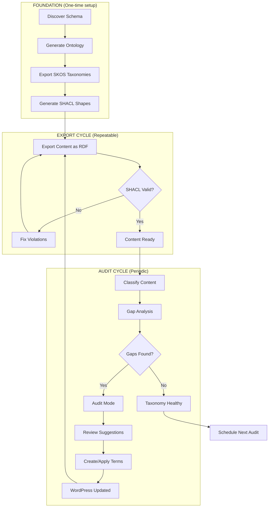

# Content Analysis Pipeline Playbook

A step-by-step guide for auditing WordPress taxonomies against actual content using LLM-powered analysis, with optional semantic web integration.

## Overview

This pipeline:
1. Exports content and schema from WordPress
2. Optionally exports vocabularies as SKOS for richer LLM context
3. Audits content against existing taxonomies using AI
4. Reviews and approves suggestions
5. Optionally validates exported content with SHACL
6. Applies approved taxonomy changes

---

## Pipeline Architecture

The complete knowledge graph maintenance pipeline:

```
┌─────────────────────────────────────────────────────────────────────────────┐
│                        KNOWLEDGE GRAPH BEDROCK                               │
│                                                                              │
│  ┌──────────────────┐    ┌──────────────────┐    ┌──────────────────┐      │
│  │    WordPress     │    │  wp-to-file-graph │    │    Output        │      │
│  │    (Source)      │───▶│  (Transform)      │───▶│    (Artifacts)   │      │
│  ├──────────────────┤    ├──────────────────┤    ├──────────────────┤      │
│  │ • Posts/CPTs     │    │ • SchemaDiscovery │    │ • schema.json    │      │
│  │ • Taxonomies     │    │ • VocabularyGen   │    │ • ontology.ttl   │      │
│  │ • ACF Fields     │    │ • SKOSProcessor   │    │ • taxonomies.skos│      │
│  │ • Relationships  │    │ • RDFProcessor    │    │ • content.ttl    │      │
│  └──────────────────┘    │ • SHACLShapeGen   │    │ • shapes.ttl     │      │
│                          └──────────────────┘    └──────────────────┘      │
└─────────────────────────────────────────────────────────────────────────────┘
                                    │
                                    ▼
┌─────────────────────────────────────────────────────────────────────────────┐
│                        VALIDATION LAYER                                      │
│                                                                              │
│  ┌──────────────────┐    ┌──────────────────┐    ┌──────────────────┐      │
│  │  SHACL Validate  │    │   Validation     │    │    Action        │      │
│  │  (Quality Gate)  │───▶│   Report         │───▶│    Required?     │      │
│  ├──────────────────┤    ├──────────────────┤    ├──────────────────┤      │
│  │ • shapes.ttl     │    │ • Conformant ✓   │    │ • Fix content    │      │
│  │ • content.ttl    │    │ • Violations ✗   │    │ • Adjust shapes  │      │
│  │ • pyshacl/Jena   │    │ • Missing fields │    │ • Add taxonomies │      │
│  └──────────────────┘    └──────────────────┘    └────────┬─────────┘      │
└─────────────────────────────────────────────────────────────│───────────────┘
                                                              │
                                                              ▼
┌─────────────────────────────────────────────────────────────────────────────┐
│                        AUDIT & IMPROVEMENT LOOP                              │
│                                                                              │
│  ┌──────────────────┐    ┌──────────────────┐    ┌──────────────────┐      │
│  │ ai-taxonomy-audit│    │   Human Review   │    │   Apply Changes  │      │
│  │ (Classification) │───▶│   (Quality Ctrl) │───▶│   (WordPress)    │      │
│  ├──────────────────┤    ├──────────────────┤    ├──────────────────┤      │
│  │ • Benchmark mode │    │ • CSV review     │    │ • wp term create │      │
│  │ • Audit mode     │    │ • Approve/reject │    │ • wp post term   │      │
│  │ • Gap analysis   │    │ • Create terms   │    │   add            │      │
│  │ • Suggestions    │    │ • Edit content   │    │ • Content edits  │      │
│  └──────────────────┘    └──────────────────┘    └────────┬─────────┘      │
└─────────────────────────────────────────────────────────────│───────────────┘
                                                              │
                                              ┌───────────────┘
                                              ▼
                              ┌───────────────────────────────┐
                              │      LOOP BACK TO EXPORT      │
                              │   (Re-export, re-validate)    │
                              └───────────────────────────────┘
```

### Workflow Summary

| Phase | Tool | Input | Output | Human Touch |
|-------|------|-------|--------|-------------|
| **1. Discover** | `wp wptofile-graph discover` | WordPress | `schema.json` | Review structure |
| **2. Vocabulary** | `wp wptofile-graph vocab` | schema.json | `ontology.ttl` | Review classes |
| **3. Taxonomies** | `wp wptofile-graph skos_multiple` | schema.json | `taxonomies.skos.ttl` | Review hierarchy |
| **4. Shapes** | `wp wptofile-graph shapes` | schema.json | `shapes.ttl` | Define constraints |
| **5. Export** | `wp wptofile rdf` | WordPress | `content/*.ttl` | — |
| **6. Validate** | `wp wptofile-graph validate` | content + shapes | Report | Fix violations |
| **7. Classify** | `wp taxonomy-audit classify` | content + vocab | Suggestions | — |
| **7b. Classify (SKOS)** | `wp taxonomy-audit classify --skos-context=...` | content + SKOS vocab | Hierarchical suggestions | — |
| **8. Audit** | `wp taxonomy-audit classify --audit` | content + vocab | Gaps + new terms | Review suggestions |
| **9. Apply** | `wp taxonomy-audit apply` | Approved CSV | WordPress updated | Approve changes |
| **10. Loop** | → Back to Step 5 | — | — | — |

### The Continuous Improvement Loop



---

## Prerequisites

- WP-CLI installed and configured
- Ollama running locally (for local LLM runs)
- OpenAI API key configured (for production runs)

### Plugin Dependencies

| Plugin | Location | Purpose |
|--------|----------|---------|
| wp-to-file | `mu-plugins/wp-to-file` | Content export to JSON/RDF |
| wp-to-file-graph | `plugins/wp-to-file-graph` | Schema discovery, SKOS, SHACL, ontologies |
| ai-taxonomy-audit | `plugins/ai-taxonomy-audit` | AI-powered taxonomy classification |

### Check Plugin Status

```bash
# Verify ai-taxonomy-audit is working
wp taxonomy-audit status

# Check wp-to-file-graph commands
wp wptofile-graph --help

# Check Ollama is running (for local LLM)
curl http://localhost:11434/api/tags

# Check SHACL validator availability (optional)
wp wptofile-graph validate-check
```

---

## Quick Start (Minimal Workflow)

For a quick taxonomy audit without semantic web features:

```bash
# 1. Check taxonomy stats
wp taxonomy-audit stats --post_type=post --taxonomies=category,post_tag

# 2. Dry run to estimate costs
wp taxonomy-audit classify --post_type=post --limit=20 --provider=openai --dry-run

# 3. Run classification (benchmark mode - vocabulary only)
wp taxonomy-audit classify --post_type=post --limit=20 --provider=openai --format=csv

# 4. Review CSV, then apply
wp taxonomy-audit apply --file=output/suggestions-*.csv --approved-only
```

### With Audit Mode (Gap-Filling)

To also get suggestions for new terms that should exist:

```bash
# Run with --audit to enable gap-filling suggestions
wp taxonomy-audit classify --audit --post_type=post --limit=20 --provider=openai --format=csv
```

See [Classification Modes](#classification-modes) for details.

---

## Full Pipeline (with Semantic Web Integration)

### Phase 1: Export Content & Schema

#### 1.1 Create Export Directories

```bash
mkdir -p wp-content/export/clause-json
mkdir -p vocab
```

#### 1.2 Export Posts

```bash
# Export posts as JSON
wp wptofile clause-json --post_type=clause --file_type=json --limit=100

# Or use a profile
wp wptofile clause-json --profile=content-analysis
```

#### 1.3 Discover Content Schema

```bash
# Discover schema for specific post types
wp wptofile-graph discover clause --format=json --output=vocab/schema.json

# View as table for quick overview
wp wptofile-graph discover clause --format=table
```

#### 1.4 Export Taxonomy Stats

```bash
wp taxonomy-audit stats --post_type=clause --taxonomies=jurisdiction,climate-or-nature-outcome
```

---

### Phase 2: Generate Vocabularies (Optional but Recommended)

Generate semantic web vocabularies for richer LLM context and validation.

#### 2.1 Generate OWL Ontology

```bash
wp wptofile-graph vocab \
    --schema=vocab/schema.json \
    --namespace=https://example.org/vocab/ \
    --prefix=vocab \
    --title="Content Vocabulary" \
    --output=vocab/ontology.ttl
```

#### 2.2 Export Taxonomies as SKOS

```bash
wp wptofile-graph skos_multiple \
    --schema=vocab/schema.json \
    --base-uri=https://example.org/taxonomy/ \
    --language=en-GB \
    --output=vocab/taxonomies.skos.ttl
```

#### 2.3 Generate SHACL Shapes

```bash
wp wptofile-graph shapes \
    --schema=vocab/schema.json \
    --shapes-namespace=https://example.org/shapes/ \
    --vocab-namespace=https://example.org/vocab/ \
    --require-taxonomies=climate-or-nature-outcome \
    --output=vocab/shapes.ttl
```

**Why these matter:**
- **SKOS** provides hierarchies and definitions for smarter LLM classification (use with `--skos-context`)
- **SHACL** validates that exported content meets quality constraints
- **OWL** documents your content model for AI agents

#### 2.4 Use SKOS for Enhanced Classification

Once you have SKOS taxonomies exported, use them to give the LLM hierarchical context:

```bash
# Classification with SKOS context (hierarchical vocabulary)
wp taxonomy-audit classify \
    --post_type=clause \
    --taxonomies=jurisdiction,climate-or-nature-outcome \
    --skos-context=vocab/taxonomies.skos.ttl \
    --provider=openai \
    --limit=20
```

**Benefits of SKOS context:**
- LLM sees parent/child relationships (e.g., "mitigation" is narrower than "climate")
- SKOS definitions often richer than WordPress term descriptions
- Encourages selection of specific terms when content is specific
- Hierarchical prompt format visually shows term relationships

---

## Classification Modes

The classifier supports two modes with optional SKOS enhancement:

| Mode | Flag | Behaviour |
|------|------|-----------|
| **Benchmark** | *(default)* | Validates content against existing vocabulary only. Terms not in vocabulary are rejected. |
| **Audit** | `--audit` | Benchmark + suggests new terms that should exist in the vocabulary. |
| **+ SKOS Context** | `--skos-context=<file>` | Enhances either mode with hierarchical vocabulary from SKOS Turtle file. |

### Benchmark Mode (Default)

Use when you want to classify content using your existing taxonomy vocabulary:

```bash
wp taxonomy-audit classify --post_type=post --limit=20 --provider=openai
```

Output only includes terms that exist in your vocabulary.

### Audit Mode

Use when you want to discover gaps in your vocabulary:

```bash
wp taxonomy-audit classify --audit --post_type=post --limit=20 --provider=openai
```

Output includes:
- **Confirmed terms** (`in_vocabulary: true`) — existing vocabulary terms the AI recommends
- **Suggested terms** (`in_vocabulary: false`) — new terms the AI thinks should be added to your vocabulary

**Audit mode workflow:**

1. Run audit classification with `--audit` flag
2. Review the output (CSV or generated script)
3. The generated script includes:
   - **STEP 1**: Commented-out `wp term create` commands for suggested new terms
   - **STEP 2**: Commented-out `wp post term add` commands to assign terms to posts
4. Uncomment and run the term creation commands you approve
5. Uncomment and run the term assignment commands

**Example generated script output:**

```bash
# ═══════════════════════════════════════════════════════════════════════════
# SUGGESTED NEW TERMS (require creation before applying)
# ═══════════════════════════════════════════════════════════════════════════
#
# STEP 1: Create approved new terms (uncomment lines below)
#
# --- CLIMATE-OR-NATURE-OUTCOME ---
# Reason: Content discusses biodiversity decline impacts
# wp term create 'climate-or-nature-outcome' 'Biodiversity Loss' --slug='biodiversity-loss'
#
# STEP 2: Apply new terms to posts (uncomment after creating terms above)
#
# Assign "biodiversity-loss" to 3 post(s):
# wp post term add 123 'climate-or-nature-outcome' 'biodiversity-loss'
# wp post term add 456 'climate-or-nature-outcome' 'biodiversity-loss'
# wp post term add 789 'climate-or-nature-outcome' 'biodiversity-loss'
```

---

### Phase 3: Taxonomy Audit (Local LLM - Development)

Run a smaller batch first to validate the approach.

#### 3.1 Dry Run (20 posts)

```bash
wp taxonomy-audit classify \
    --post_type=clause \
    --limit=20 \
    --taxonomies=jurisdiction,climate-or-nature-outcome \
    --provider=ollama \
    --model=qwen2.5:14b \
    --format=json \
    --dry-run
```

#### 3.2 Run Classification

```bash
wp taxonomy-audit classify \
    --post_type=clause \
    --limit=20 \
    --taxonomies=jurisdiction,climate-or-nature-outcome \
    --provider=ollama \
    --model=qwen2.5:14b \
    --format=json \
    --min-confidence=0.7 \
    --save-run \
    --run-notes="Development run - local Ollama"
```

Output: `wp-content/plugins/ai-taxonomy-audit/output/runs/<timestamp>/`

#### 3.3 Review Suggestions

```bash
# List recent runs
wp taxonomy-audit runs-list

# Show run details
wp taxonomy-audit runs-show <run-id>
```

---

### Phase 4: Taxonomy Audit (Production - Full Run)

After validating the local run, execute the full analysis with a production model.

#### 4.1 Estimate Costs

```bash
wp taxonomy-audit classify \
    --post_type=clause \
    --limit=100 \
    --taxonomies=jurisdiction,climate-or-nature-outcome \
    --provider=openai \
    --model=gpt-4o-mini \
    --dry-run
```

#### 4.2 Full Classification

```bash
wp taxonomy-audit classify \
    --post_type=clause \
    --limit=100 \
    --taxonomies=jurisdiction,climate-or-nature-outcome \
    --provider=openai \
    --model=gpt-4o-mini \
    --format=csv \
    --min-confidence=0.7 \
    --save-run \
    --run-notes="Production run - GPT-4o-mini"
```

#### 4.2b Full Classification with SKOS Context (Recommended)

For better term specificity, use SKOS hierarchical context:

```bash
wp taxonomy-audit classify \
    --post_type=clause \
    --limit=100 \
    --taxonomies=jurisdiction,climate-or-nature-outcome \
    --skos-context=vocab/taxonomies.skos.ttl \
    --provider=openai \
    --model=gpt-4o-mini \
    --format=csv \
    --min-confidence=0.7 \
    --save-run \
    --run-notes="Production run with SKOS context"
```

The SKOS file provides the LLM with:
- Broader/narrower term relationships
- SKOS definitions (often richer than WP descriptions)
- Visual hierarchy in the prompt (indented child terms)

#### 4.3 Run Gap Analysis

```bash
wp taxonomy-audit gap-analysis \
    --suggestions=output/runs/<run-id>/suggestions.json \
    --taxonomies=jurisdiction,climate-or-nature-outcome \
    --save-run=<run-id>
```

Output includes:
- **Suggested new terms** — terms the LLM thinks should exist
- **Unused existing terms** — terms never suggested
- **Ambiguous terms** — low average confidence
- **Health score** — overall taxonomy fitness

---

### Phase 5: Review & Apply Changes

#### 5.1 Review Suggestions

Open the CSV in a spreadsheet:

| Column | Description |
|--------|-------------|
| `post_id` | WordPress post ID |
| `post_title` | Post title for reference |
| `taxonomy` | Target taxonomy |
| `suggested_term` | Suggested term slug |
| `confidence` | Confidence score (0-1) |
| `reason` | LLM's reasoning |
| `in_vocabulary` | `TRUE` if term exists in vocabulary, `FALSE` if suggested new term (audit mode only) |
| `approved` | Mark `TRUE` to approve |

**Note:** When applying suggestions, only terms with `in_vocabulary: TRUE` (or empty) will generate WP-CLI commands. Suggested new terms (`in_vocabulary: FALSE`) must be created manually first.

#### 5.2 Dry Run Application

```bash
wp taxonomy-audit apply \
    --file=output/runs/<run-id>/suggestions.csv \
    --approved-only \
    --dry-run
```

#### 5.3 Apply Approved Changes

```bash
wp taxonomy-audit apply \
    --file=output/runs/<run-id>/suggestions.csv \
    --approved-only
```

#### 5.4 Alternative: Generate Script

```bash
wp taxonomy-audit generate-script \
    --file=output/runs/<run-id>/suggestions.csv \
    --approved-only \
    --output=apply-taxonomies.sh \
    --prefix="wp"

# Review and execute
chmod +x apply-taxonomies.sh
./apply-taxonomies.sh
```

---

### Phase 6: Export & Validate Content (Optional)

After applying taxonomy changes, export enriched content and validate.

#### 6.1 Export Content as RDF

```bash
wp wptofile rdf --file_type=ttl --post_type=clause --output=export/rdf
```

#### 6.2 Validate Against SHACL Shapes

```bash
# Check validator is available
wp wptofile-graph validate-check

# Validate exported RDF
wp wptofile-graph validate export/rdf/ --shapes=vocab/shapes.ttl
```

**Example output:**
```
Validation Summary
==================
Total files:        50
Conformant:         48
Non-conformant:     2
Total violations:   3

Non-conformant files:
  - export/rdf/clause-123.ttl (2 violations)
  - export/rdf/clause-456.ttl (1 violation)
```

#### 6.3 Fix Violations

Review violations and either:
- Update the source content in WordPress
- Adjust the SHACL shapes if constraints are too strict
- Re-run classification on specific posts

```bash
wp taxonomy-audit classify \
    --post-ids=123,456 \
    --provider=openai \
    --format=terminal
```

---

### Phase 7: Prune Unused Terms (Optional)

After analysis, clean up unused taxonomy terms.

#### 7.1 Find Unused Terms

```bash
wp taxonomy-audit unused-terms --taxonomies=category,post_tag
```

#### 7.2 Find Mismatched Terms

Terms that have posts but were never suggested by the LLM:

```bash
wp taxonomy-audit mismatched-terms \
    --suggestions=output/runs/<run-id>/suggestions.json \
    --taxonomies=category,post_tag
```

#### 7.3 Generate Prune Script

```bash
wp taxonomy-audit generate-prune-script \
    --taxonomies=category,post_tag \
    --output=prune-terms.sh

# Review carefully before running!
cat prune-terms.sh
```

---

## Command Reference

### Export Commands (wp-to-file-graph)

```bash
# Discover schema
wp wptofile-graph discover <post-types> --format=json --output=schema.json

# Generate OWL ontology
wp wptofile-graph vocab --schema=schema.json --output=ontology.ttl

# Export SKOS taxonomies
wp wptofile-graph skos_multiple --schema=schema.json --output=taxonomies.skos.ttl

# Generate SHACL shapes
wp wptofile-graph shapes --schema=schema.json --output=shapes.ttl

# Validate RDF
wp wptofile-graph validate export/rdf/ --shapes=shapes.ttl
```

### Classification Commands (ai-taxonomy-audit)

```bash
# Check status
wp taxonomy-audit status

# Classify posts (flat vocabulary)
wp taxonomy-audit classify --post_type=<type> --limit=<n> --provider=<provider>

# Classify posts (with SKOS hierarchical context)
wp taxonomy-audit classify --post_type=<type> --limit=<n> --provider=<provider> \
    --skos-context=vocab/taxonomies.skos.ttl

# Gap analysis
wp taxonomy-audit gap-analysis --suggestions=<file>

# Apply suggestions
wp taxonomy-audit apply --file=<file> --approved-only

# Compare runs
wp taxonomy-audit runs-compare <run-a> <run-b>
```

---

## Output Files

| File | Description |
|------|-------------|
| `vocab/schema.json` | Content structure schema |
| `vocab/ontology.ttl` | OWL vocabulary (classes, properties) |
| `vocab/taxonomies.skos.ttl` | SKOS concept schemes |
| `vocab/shapes.ttl` | SHACL validation shapes |
| `output/runs/<id>/manifest.json` | Run metadata and config |
| `output/runs/<id>/suggestions.json` | AI taxonomy suggestions |
| `output/runs/<id>/suggestions.csv` | CSV for human review |
| `output/runs/<id>/gap-analysis.json` | Gap analysis results |
| `export/rdf/*.ttl` | Exported RDF content |

---

## Troubleshooting

### Ollama Not Available

```bash
# Start Ollama
ollama serve

# Pull required model
ollama pull qwen2.5:14b
```

### OpenAI API Key Not Set

Add to `wp-config.php`:

```php
define('OPENAI_API_KEY', 'sk-...');
```

### SHACL Validator Not Found

```bash
# Install pyshacl
pip install pyshacl

# Verify
wp wptofile-graph validate-check
```

### Low Classification Confidence

- Try a more capable model (gpt-4o vs gpt-4o-mini)
- Use `--min-confidence=0.6` to include more suggestions
- Check if taxonomy terms have clear, descriptive names

---

## Provider Comparison

| Provider | Model | Quality | Speed | Cost |
|----------|-------|---------|-------|------|
| Ollama | qwen2.5:14b | Good | Medium | Free (local) |
| Ollama | gemma3:27b | Better | Slow | Free (local) |
| OpenAI | gpt-4o-mini | High | Fast | ~$0.15/1M tokens |
| OpenAI | gpt-4o | Highest | Medium | ~$2.50/1M tokens |
| OpenRouter | deepseek-chat | High | Fast | Very low |

---

## Related Documentation

- `README.md` — Full command reference
- `wp-to-file-graph/PLAN.md` — Development plan with GoingMeta integration and future enhancements
- `wp-to-file-graph/README.md` — Graph export documentation

#ai #content #taxonomy #semantic-web
