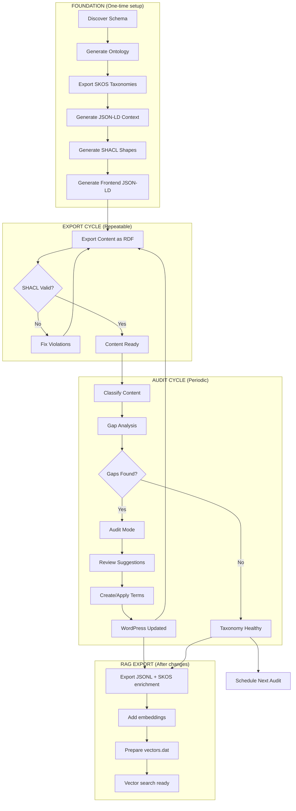

# Content Analysis Pipeline Playbook

A step-by-step guide for auditing WordPress taxonomies against actual content using LLM-powered analysis, with optional semantic web integration.

## Overview

This pipeline:
1. Exports content and schema from WordPress
2. Optionally exports vocabularies as SKOS for richer LLM context
3. Audits content against existing taxonomies using AI
4. Reviews and approves suggestions
5. Optionally validates exported content with SHACL
6. Applies approved taxonomy changes

---

## Pipeline Architecture

The complete knowledge graph maintenance pipeline:

```
┌─────────────────────────────────────────────────────────────────────────────┐
│                        KNOWLEDGE GRAPH BEDROCK                               │
│                                                                              │
│  ┌──────────────────┐    ┌──────────────────┐    ┌──────────────────┐      │
│  │    WordPress     │    │  wp-to-file-graph │    │    Output        │      │
│  │    (Source)      │───▶│  (Transform)      │───▶│    (Artifacts)   │      │
│  ├──────────────────┤    ├──────────────────┤    ├──────────────────┤      │
│  │ • Posts/CPTs     │    │ • SchemaDiscovery │    │ • schema.json    │      │
│  │ • Taxonomies     │    │ • VocabularyGen   │    │ • ontology.ttl   │      │
│  │ • ACF Fields     │    │ • SKOSProcessor   │    │ • taxonomies.skos│      │
│  │ • Relationships  │    │ • RDFProcessor    │    │ • context.jsonld │      │
│  └──────────────────┘    │ • SHACLShapeGen   │    │ • shapes.ttl     │      │
│                          │ • ContextGen      │    │ • content/*.ttl  │      │
│  ┌──────────────────┐    │ • generateHead    │    │ • jsonld-head.php│      │
│  │  Config (SSoT)   │───▶│                   │    │                  │      │
│  ├──────────────────┤    └──────────────────┘    └──────────────────┘      │
│  │ • tclp-vocab.json│                                                       │
│  │ • export-profiles│                                                       │
│  └──────────────────┘                                                       │
└─────────────────────────────────────────────────────────────────────────────┘
                                    │
                                    ▼
┌─────────────────────────────────────────────────────────────────────────────┐
│                        VALIDATION LAYER                                      │
│                                                                              │
│  ┌──────────────────┐    ┌──────────────────┐    ┌──────────────────┐      │
│  │  SHACL Validate  │    │   Validation     │    │    Action        │      │
│  │  (Quality Gate)  │───▶│   Report         │───▶│    Required?     │      │
│  ├──────────────────┤    ├──────────────────┤    ├──────────────────┤      │
│  │ • shapes.ttl     │    │ • Conformant ✓   │    │ • Fix content    │      │
│  │ • content.ttl    │    │ • Violations ✗   │    │ • Adjust shapes  │      │
│  │ • pyshacl/Jena   │    │ • Missing fields │    │ • Add taxonomies │      │
│  └──────────────────┘    └──────────────────┘    └────────┬─────────┘      │
└─────────────────────────────────────────────────────────────│───────────────┘
                                                              │
                                                              ▼
┌─────────────────────────────────────────────────────────────────────────────┐
│                        AUDIT & IMPROVEMENT LOOP                              │
│                                                                              │
│  ┌──────────────────┐    ┌──────────────────┐    ┌──────────────────┐      │
│  │ ai-taxonomy-audit│    │   Human Review   │    │   Apply Changes  │      │
│  │ (Classification) │───▶│   (Quality Ctrl) │───▶│   (WordPress)    │      │
│  ├──────────────────┤    ├──────────────────┤    ├──────────────────┤      │
│  │ • Benchmark mode │    │ • CSV review     │    │ • wp term create │      │
│  │ • Audit mode     │    │ • Approve/reject │    │ • wp post term   │      │
│  │ • Gap analysis   │    │ • Create terms   │    │   add            │      │
│  │ • Suggestions    │    │ • Edit content   │    │ • Content edits  │      │
│  └──────────────────┘    └──────────────────┘    └────────┬─────────┘      │
└─────────────────────────────────────────────────────────────│───────────────┘
                                                              │
                                                              ▼
┌─────────────────────────────────────────────────────────────────────────────┐
│                        RAG / VECTOR EXPORT                                   │
│                                                                              │
│  ┌──────────────────┐    ┌──────────────────┐    ┌──────────────────┐      │
│  │  wp-to-file-rag  │    │   JSONL Export    │    │   Vector Search  │      │
│  │  (Chunking)      │───▶│   (Embeddings)   │───▶│   (Runtime)      │      │
│  ├──────────────────┤    ├──────────────────┤    ├──────────────────┤      │
│  │ • Content chunks │    │ • clauses.jsonl  │    │ • vectors.dat    │      │
│  │ • SKOS enrichment│    │ • OpenAI embeds  │    │ • Cosine search  │      │
│  │ • ACF extraction │    │ • Token estimates│    │ • MCP abilities  │      │
│  └──────────────────┘    └──────────────────┘    └──────────────────┘      │
└─────────────────────────────────────────────────────────────────────────────┘
                                                              │
                                              ┌───────────────┘
                                              ▼
                              ┌───────────────────────────────┐
                              │      LOOP BACK TO EXPORT      │
                              │   (Re-export, re-validate)    │
                              └───────────────────────────────┘
```

### Workflow Summary

| Phase | Tool | Input | Output | Human Touch |
|-------|------|-------|--------|-------------|
| **1. Discover** | `wp wptofile-graph discover` | WordPress | `vocab/schema.json` | Review structure |
| **1b. Vocab Init** *(new site)* | `wp wptofile-graph vocab_init` | schema.json | `vocab/tclp-vocabulary.json` | Customise mappings |
| **2. Vocabulary** | `wp wptofile-graph vocab` | schema.json + tclp-vocabulary.json | `vocab/ontology.ttl` | Review classes |
| **3. Taxonomies** | `wp wptofile-graph skos_multiple` | schema.json | `vocab/taxonomies.skos.ttl` | Review hierarchy |
| **4. Context** | `wp wptofile-graph context` | ontology.ttl + tclp-vocabulary.json | `vocab/context.jsonld` | — |
| **5. Shapes** | `wp wptofile-graph shapes` | schema.json | `vocab/shapes.ttl` | Define constraints |
| **5b. Frontend** *(optional)* | `wp wptofile-graph generateHead` | tclp-vocabulary.json + export-profiles.yaml | `mu-plugins/*.php` | — |
| **6. Export** | `wp wptofile rdf` | WordPress | `export/rdf/*.ttl` | — |
| **7. Validate** | `wp wptofile-graph validate` | content + shapes | Report | Fix violations |
| **8. Classify** | `wp taxonomy-audit classify` | content + vocab | Suggestions | — |
| **8b. Classify (SKOS)** | `wp taxonomy-audit classify --skos-context=...` | content + SKOS vocab | Hierarchical suggestions | — |
| **9. Audit** | `wp taxonomy-audit classify --audit` | content + vocab | Gaps + new terms | Review suggestions |
| **10. Apply** | `wp taxonomy-audit apply` | Approved CSV | WordPress updated | Approve changes |
| **11. RAG Export** | `wp wptofile-rag export` | WordPress + SKOS | `clauses.jsonl` | — |
| **11b. Vectors** | `wp wptofile-rag prepare-vectors` | JSONL w/ embeddings | `vectors.dat` | — |
| **12. Loop** | → Back to Step 6 | — | — | — |

> **Note:** Steps 1-5 are "foundation" steps run once (or when schema changes). Steps 6-11 are the repeatable audit loop.

### The Continuous Improvement Loop



> **Regenerate foundation** when: vocabulary config changes, new taxonomies added, or schema evolves.

---

## Prerequisites

- WP-CLI installed and configured
- Ollama running locally (for local LLM runs)
- OpenAI API key configured (for production runs)
- pyshacl installed (for SHACL validation — optional but recommended)

### Plugin Dependencies

| Plugin | Location | Purpose |
|--------|----------|---------|
| wp-to-file | `mu-plugins/wp-to-file` | Content export to JSON/RDF |
| wp-to-file-graph | `plugins/wp-to-file-graph` | Schema discovery, SKOS, SHACL, ontologies |
| wp-to-file-rag | `plugins/wp-to-file-rag` | JSONL chunking, embeddings, vector search |
| ai-taxonomy-audit | `plugins/ai-taxonomy-audit` | AI-powered taxonomy classification |

### Check Plugin Status

```bash
# Verify ai-taxonomy-audit is working
wp taxonomy-audit status

# Check wp-to-file-graph commands
wp wptofile-graph --help

# Check wp-to-file-rag commands
wp wptofile-rag status

# Check Ollama is running (for local LLM)
curl http://localhost:11434/api/tags

# Check SHACL validator availability (optional)
wp wptofile-graph validate_check
```

---

## Quick Start (Minimal Workflow)

For a quick taxonomy audit without semantic web features:

```bash
# 1. Check taxonomy stats
wp taxonomy-audit stats --post_type=post --taxonomies=category,post_tag

# 2. Dry run to estimate costs
wp taxonomy-audit classify --post_type=post --limit=20 --provider=openai --dry-run

# 3. Run classification (benchmark mode - vocabulary only)
wp taxonomy-audit classify --post_type=post --limit=20 --provider=openai --format=csv

# 4. Review CSV, then apply
wp taxonomy-audit apply --file=output/suggestions-*.csv --approved-only
```

### With Audit Mode (Gap-Filling)

To also get suggestions for new terms that should exist:

```bash
# Run with --audit to enable gap-filling suggestions
wp taxonomy-audit classify --audit --post_type=post --limit=20 --provider=openai --format=csv
```

See [Classification Modes](#classification-modes) for details.

---

## Full Pipeline (with Semantic Web Integration)

### Phase 1: Export Content & Schema

#### 1.1 Create Export Directories

```bash
mkdir -p wp-content/export/clause-json
mkdir -p vocab
```

#### 1.2 Export Posts

```bash
# Export posts as JSON
wp wptofile clause-json --post_type=clause --file_type=json --limit=100

# Export maintained posts as JSON
wp wptofile clause-json --post-ids=2007,2043,6711,2293,2023,7703,2115,2041,8799,2161,2009,2249,7589,2129,2029,2101 --post_type=clause --file_type=json

# Or use a profile
wp wptofile clause-json --profile=content-analysis
```

#### 1.3 Discover Content Schema

```bash
# Discover schema for specific post types
wp wptofile-graph discover clause --format=json --output=vocab/schema.json

# View as table for quick overview
wp wptofile-graph discover clause --format=table
```

#### 1.4 Export Taxonomy Stats

```bash
wp taxonomy-audit stats --post_type=clause --taxonomies=jurisdiction,climate-or-nature-outcome
```

---

### Phase 2: Generate Vocabularies (Optional but Recommended)

Generate semantic web vocabularies for richer LLM context and validation.

#### 2.0 Scaffold Vocabulary Config (New Sites Only)

If `tclp-vocabulary.json` doesn't exist yet, scaffold it from the discovered schema:

```bash
wp wptofile-graph vocab_init \
    --schema=vocab/schema.json \
    --namespace=https://example.org/vocab/ \
    --prefix=vocab \
    --taxonomy-base-uri=https://example.org/taxonomy/ \
    --output=vocab/tclp-vocabulary.json
```

Review the generated file: rename `property` values to match your RDF vocabulary, set `multi_valued: false` for single-select taxonomies, and add `extra_properties` for non-taxonomy fields.

#### 2.1 Generate OWL Ontology

```bash
# Basic generation (auto-generates property names from taxonomy slugs)
wp wptofile-graph vocab \
    --schema=vocab/schema.json \
    --namespace=https://example.org/vocab/ \
    --prefix=vocab \
    --title="Content Vocabulary" \
    --output=vocab/ontology.ttl

# With vocabulary config (cleaner names + extra properties)
wp wptofile-graph vocab \
    --schema=vocab/schema.json \
    --property-map=vocab/tclp-vocabulary.json \
    --namespace=https://example.org/vocab/ \
    --prefix=vocab \
    --title="Content Vocabulary" \
    --output=vocab/ontology.ttl
```

**Unified vocabulary config format (`vocab/tclp-vocabulary.json`):**

This file is the single source of truth for vocabulary configuration, used by:
- The `generateHead` command for frontend JSON-LD output
- The vocab pipeline for ontology generation
- The jsonld command for CLI exports

```json
{
    "namespace": "https://example.org/vocab/",
    "prefix": "tclp",
    "taxonomy_mappings": {
        "climate-or-nature-outcome": {
            "property": "climateOutcome",
            "label": "Climate or nature outcome",
            "multi_valued": true,
            "post_types": ["clause", "guide"]
        }
    },
    "extra_properties": {
        "documentType": {
            "label": "Document type",
            "type": "datatype",
            "range": "xsd:string"
        }
    }
}
```

#### 2.2 Export Taxonomies as SKOS

```bash
wp wptofile-graph skos_multiple \
    --schema=vocab/schema.json \
    --base-uri=https://example.org/taxonomy/ \
    --language=en-GB \
    --output=vocab/taxonomies.skos.ttl
```

#### 2.3 Generate SHACL Shapes

```bash
wp wptofile-graph shapes \
    --schema=vocab/schema.json \
    --shapes-namespace=https://example.org/shapes/ \
    --vocab-namespace=https://example.org/vocab/ \
    --require-taxonomies=climate-or-nature-outcome \
    --output=vocab/shapes.ttl
```

#### 2.4 Generate JSON-LD Context

The JSON-LD context file maps your `tclp:` prefixed terms to full IRIs, enabling JSON-LD consumers to expand and validate your structured data.

```bash
# Basic generation (from ontology only)
wp wptofile-graph context \
    --ontology=vocab/ontology.ttl \
    --namespace=https://example.org/vocab/ \
    --prefix=tclp \
    --output=vocab/context.jsonld

# With vocabulary config (adds @container: @set for multi-valued, XSD types)
wp wptofile-graph context \
    --ontology=vocab/ontology.ttl \
    --property-map=vocab/tclp-vocabulary.json \
    --namespace=https://example.org/vocab/ \
    --prefix=tclp \
    --output=vocab/context.jsonld
```

The vocabulary config's `taxonomy_mappings[].multi_valued` flags control which properties get `@container: @set`. XSD types are automatically extracted from ontology `rdfs:range`.

Or create manually based on your ontology:

```json
{
    "@context": {
        "@vocab": "http://schema.org/",
        "tclp": "https://example.org/vocab/",
        "skos": "http://www.w3.org/2004/02/skos/core#",
        "tclp:documentType": {"@type": "@id"},
        "tclp:climateOutcome": {"@type": "@id", "@container": "@set"},
        "tclp:climateSolution": {"@type": "@id", "@container": "@set"},
        "tclp:jurisdiction": {"@type": "@id"},
        "tclp:practiceArea": {"@type": "@id"},
        "tclp:contentType": {"@type": "@id"},
        "tclp:maintenanceStatus": {"@type": "@id"},
        "tclp:contractLifecycleStage": {"@type": "@id"},
        "tclp:directionOfObligation": {"@type": "@id"},
        "tclp:principle": {"@type": "@id"},
        "tclp:relatedStandard": {"@type": "@id", "@container": "@set"},
        "tclp:lastReviewedDate": {"@type": "http://www.w3.org/2001/XMLSchema#date"}
    }
}
```

**Why `context.jsonld` matters:**
- Your HTML pages embed JSON-LD with `@context` pointing to this file
- Without it, `tclp:climateOutcome` is an opaque string, not a resolvable IRI
- Enables conversion of JSON-LD → RDF for SHACL validation
- Ensures semantic interoperability with other linked data consumers

**Host at:** `https://example.org/vocab/context.jsonld`

**Why these matter:**
- **OWL** documents your content model for AI agents
- **SKOS** provides hierarchies and definitions for smarter LLM classification (use with `--skos-context`)
- **JSON-LD Context** maps prefixed terms to full IRIs for structured data consumers
- **SHACL** validates that exported content meets quality constraints

#### 2.5 Generate Frontend JSON-LD (Optional)

To output JSON-LD in your site's `<head>` for search engines and AI agents, generate a standalone PHP file:

```bash
# Generate self-contained PHP file for wp_head
wp wptofile-graph generateHead --output=wp-content/mu-plugins/tclp-jsonld-head.php

# Preview first
wp wptofile-graph generateHead

# Custom options
wp wptofile-graph generateHead \
  --class-name=TCLP_JSONLD_Head \
  --post-types=clause,guide \
  --context-url=https://example.org/vocab/context.jsonld \
  --output=mu-plugins/tclp-jsonld-head.php
```

**Key features:**
- **Self-contained** — No runtime dependencies on wp-to-file-graph
- **Config baked in** — Vocabulary mappings and computed fields embedded
- **Regenerable** — Re-run when config changes

**When to regenerate:**
- After updating `vocab/tclp-vocabulary.json`
- After adding computed fields to `export-profiles.yaml`
- After adding new taxonomies

#### 2.6 Use SKOS for Enhanced Classification

Once you have SKOS taxonomies exported, use them to give the LLM hierarchical context:

```bash
# Classification with SKOS context (hierarchical vocabulary)
wp taxonomy-audit classify \
    --post_type=clause \
    --taxonomies=jurisdiction,climate-or-nature-outcome \
    --skos-context=vocab/taxonomies.skos.ttl \
    --provider=openai \
    --limit=20
```

**Benefits of SKOS context:**
- LLM sees parent/child relationships (e.g., "mitigation" is narrower than "climate")
- SKOS definitions often richer than WordPress term descriptions
- Encourages selection of specific terms when content is specific
- Hierarchical prompt format visually shows term relationships

---

## Three Dimensions of Taxonomy Audit

When auditing taxonomies, the tool answers three distinct questions:

| Dimension | Question | CSV Status | Mode Required |
|-----------|----------|------------|---------------|
| **1. Correctness** | Are existing terms correctly applied? | `KEEP` | Both |
| **2. Completeness** | What existing terms should be added? | `ADD` | Both |
| **3. Vocabulary Gaps** | What new terms should be created? | `NEW` | Audit only |

### Understanding the Status Column

The CSV output includes a `status` column that tells you exactly what action is needed:

| Status | Meaning | Action Required |
|--------|---------|-----------------|
| `KEEP` | Term already applied, LLM agrees | None (validates existing) |
| `ADD` | Term exists in vocab, should be added | Apply the term |
| `NEW` | Term doesn't exist in vocabulary | Create term first, then apply |

### Example CSV Output

```csv
post_id,existing_terms,suggested_term,confidence,status,in_vocabulary
2007,"climate-risk",climate-risk,0.90,KEEP,TRUE
2007,"climate-risk",decarbonisation,0.95,ADD,TRUE
2007,"climate-risk",carbon-accounting,0.85,NEW,FALSE
```

This tells you:
- `climate-risk` is correctly applied ✓
- `decarbonisation` should be added (exists in vocab)
- `carbon-accounting` is a vocabulary gap (create it first)

---

## Classification Modes

The classifier supports two modes with optional SKOS enhancement:

| Mode | Flag | Dimensions Covered |
|------|------|-------------------|
| **Benchmark** | *(default)* | 1 (Correctness) + 2 (Completeness) |
| **Audit** | `--audit` | 1 + 2 + 3 (Vocabulary Gaps) |
| **+ SKOS Context** | `--skos-context=<file>` | Enhances either mode with hierarchical vocabulary |

### Benchmark Mode (Default)

Use when you want to validate existing classifications and find missing terms from your current vocabulary:

```bash
wp taxonomy-audit classify --post_type=post --limit=20 --provider=openai
```

Output includes `KEEP` and `ADD` status values. Terms not in vocabulary are rejected.

### Audit Mode

Use when you also want to discover vocabulary gaps:

```bash
wp taxonomy-audit classify --audit --post_type=post --limit=20 --provider=openai
```

Output includes all three status values:
- `KEEP` — existing terms the LLM agrees with
- `ADD` — existing vocabulary terms that should be applied
- `NEW` — suggested terms that don't exist yet (`in_vocabulary: FALSE`)

**Audit mode workflow:**

1. Run audit classification with `--audit` flag
2. Review the output (CSV or generated script)
3. The generated script includes:
   - **STEP 1**: Commented-out `wp term create` commands for suggested new terms
   - **STEP 2**: Commented-out `wp post term add` commands to assign terms to posts
4. Uncomment and run the term creation commands you approve
5. Uncomment and run the term assignment commands

**Example generated script output:**

```bash
# ═══════════════════════════════════════════════════════════════════════════
# SUGGESTED NEW TERMS (require creation before applying)
# ═══════════════════════════════════════════════════════════════════════════
#
# STEP 1: Create approved new terms (uncomment lines below)
#
# --- CLIMATE-OR-NATURE-OUTCOME ---
# Reason: Content discusses biodiversity decline impacts
# wp term create 'climate-or-nature-outcome' 'Biodiversity Loss' --slug='biodiversity-loss'
#
# STEP 2: Apply new terms to posts (uncomment after creating terms above)
#
# Assign "biodiversity-loss" to 3 post(s):
# wp post term add 123 'climate-or-nature-outcome' 'biodiversity-loss'
# wp post term add 456 'climate-or-nature-outcome' 'biodiversity-loss'
# wp post term add 789 'climate-or-nature-outcome' 'biodiversity-loss'
```

---

### Phase 3: Taxonomy Audit (Local LLM - Development)

Run a smaller batch first to validate the approach.

#### 3.1 Dry Run (20 posts)

```bash
wp taxonomy-audit classify \
    --post_type=clause \
    --limit=3 \
    --taxonomies=jurisdiction,climate-or-nature-outcome \
    --provider=ollama \
    --model=qwen2.5:latest \
    --format=json \
    --dry-run
```

#### 3.2 Run Classification

```bash
wp taxonomy-audit classify \
    --post_type=clause \
    --limit=20 \
    --taxonomies=jurisdiction,climate-or-nature-outcome \
    --provider=ollama \
    --model=qwen2.5:latest \
    --format=json \
    --min-confidence=0.7 \
    --save-run \
    --run-notes="Development run - local Ollama"
```

Output: `wp-content/plugins/ai-taxonomy-audit/output/runs/<timestamp>/`

#### 3.3 Review Suggestions

```bash
# List recent runs
wp taxonomy-audit runs-list

# Show run details
wp taxonomy-audit runs-show <run-id>
```

---

### Phase 4: Taxonomy Audit (Production - Full Run)

After validating the local run, execute the full analysis with a production model.

#### 4.1 Estimate Costs

```bash
wp taxonomy-audit classify \
    --post_type=clause \
    --limit=100 \
    --taxonomies=jurisdiction,climate-or-nature-outcome \
    --provider=openai \
    --model=gpt-4o-mini \
    --dry-run
```

#### 4.2 Full Classification

Use this option if your taxonomies are flat (no parent/child relationships) or very small. Otherwise use 4.2b below

```bash
wp taxonomy-audit classify \
    --post_type=clause \
    --limit=100 \
    --taxonomies=jurisdiction,climate-or-nature-outcome \
    --provider=openai \
    --model=gpt-4o-mini \
    --format=csv \
    --min-confidence=0.7 \
    --save-run \
    --run-notes="Production run - GPT-4o-mini"
```

#### 4.2b Full Classification with SKOS Context (Recommended)

For better term specificity,use SKOS hierarchical context:

```bash
wp taxonomy-audit classify \
    --post_type=clause \
    --limit=100 \
    --taxonomies=jurisdiction,climate-or-nature-outcome \
    --skos-context=vocab/taxonomies.skos.ttl \
    --provider=openai \
    --model=gpt-4o-mini \
    --format=csv \
    --min-confidence=0.7 \
    --save-run \
    --run-notes="Production run with SKOS context"
```

The SKOS file provides the LLM with:
- Broader/narrower term relationships
- SKOS definitions (often richer than WP descriptions)
- Visual hierarchy in the prompt (indented child terms)

#### 4.3 Audit Mode (Discover Vocabulary Gaps)

After reviewing benchmark results, run audit mode to discover what terms are missing from your vocabulary:

```bash
wp taxonomy-audit classify \
    --post_type=clause \
    --post-ids=2007,2043,6711 \
    --taxonomies=jurisdiction,climate-or-nature-outcome \
    --skos-context=vocab/taxonomies.skos.ttl \
    --provider=ollama \
    --model=qwen2.5:latest \
    --audit \
    --save-run \
    --run-notes="Audit mode - looking for vocabulary gaps"
```

The `--audit` flag tells the LLM to also suggest terms that **should exist** but don't. Look for rows with `status: NEW` — these are vocabulary gap suggestions.

#### 4.4 Run Gap Analysis

```bash
wp taxonomy-audit gap-analysis \
    --suggestions=output/runs/<run-id>/suggestions.json \
    --taxonomies=jurisdiction,climate-or-nature-outcome \
    --save-run=<run-id>
```

Output includes:
- **Suggested new terms** — terms the LLM thinks should exist
- **Unused existing terms** — terms never suggested (pruning candidates)
- **Ambiguous terms** — low average confidence (may need clearer definitions)
- **Health score** — overall taxonomy fitness (0-100)

---

### Phase 5: Review & Apply Changes

#### 5.1 Review Suggestions

Open the CSV in a spreadsheet:

| Column | Description |
|--------|-------------|
| `post_id` | WordPress post ID |
| `post_title` | Post title for reference |
| `post_url` | Post URL for quick access |
| `taxonomy` | Target taxonomy |
| `existing_terms` | Terms **currently applied** to this post |
| `suggested_term` | LLM's suggested term slug |
| `confidence` | Confidence score (0-1) |
| `reason` | LLM's reasoning |
| `status` | `KEEP`, `ADD`, or `NEW` (see below) |
| `in_vocabulary` | `TRUE` if term exists, `FALSE` if suggested new term |
| `approved` | Mark `TRUE` to approve |

**Status Column Quick Reference:**

| Status | What It Means | Your Action |
|--------|---------------|-------------|
| `KEEP` | Term already applied, LLM agrees it's correct | No action (validates existing classification) |
| `ADD` | Term exists in vocab, LLM says add it | Apply the term to the post |
| `NEW` | Term doesn't exist (audit mode) | Create term first, then apply |

**Workflow by Status:**

1. **Filter by `KEEP`** — Review these to validate your existing classifications are correct
2. **Filter by `ADD`** — These are actionable: terms to apply from your existing vocabulary
3. **Filter by `NEW`** — These require vocabulary decisions: should you create these terms?

**Note:** Only `ADD` and `KEEP` terms can be directly applied. `NEW` terms must be created first with `wp term create <taxonomy> <term-slug>`.

#### 5.2 Dry Run Application

```bash
wp taxonomy-audit apply \
    --file=output/runs/<run-id>/suggestions.csv \
    --approved-only \
    --dry-run
```

#### 5.3 Apply Approved Changes

```bash
wp taxonomy-audit apply \
    --file=output/runs/<run-id>/suggestions.csv \
    --approved-only
```

#### 5.4 Alternative: Generate Script

```bash
wp taxonomy-audit generate-script \
    --file=output/runs/<run-id>/suggestions.csv \
    --approved-only \
    --output=apply-taxonomies.sh \
    --prefix="wp"

# Review and execute
chmod +x apply-taxonomies.sh
./apply-taxonomies.sh
```

---

### Phase 5b: RAG Export (Optional)

After applying taxonomy changes, export content as JSONL for vector database ingestion. The SKOS file from Phase 2 enriches taxonomy metadata with broader/narrower hierarchy.

#### 5b.1 Export to JSONL with SKOS Enrichment

```bash
# Basic JSONL export (uses ACF fields from export-profiles.yaml)
wp wptofile-rag export --post_type=clause --output=wp-content/export/clauses.jsonl

# With SKOS taxonomy enrichment
wp wptofile-rag export \
    --post_type=clause \
    --skos-file=vocab/taxonomies.skos.ttl \
    --output=wp-content/export/clauses.jsonl

# Dry run to preview chunk counts
wp wptofile-rag export --post_type=clause --dry-run
```

The export reads `post_type_configs` from `wp-to-file/config/export-profiles.yaml` (via `symfony/yaml`) to determine ACF field extraction, taxonomy filtering, and relationship fields.

#### 5b.2 Add Embeddings

```bash
# Estimate costs first
wp wptofile-rag cost-estimate --post_type=clause --model=text-embedding-3-small

# Export with embeddings
wp wptofile-rag export \
    --post_type=clause \
    --skos-file=vocab/taxonomies.skos.ttl \
    --include_embeddings \
    --output=wp-content/export/clauses-with-embeddings.jsonl
```

#### 5b.3 Prepare for Vector Search

```bash
# Convert JSONL to PHP-optimised vector format
wp wptofile-rag prepare-vectors --input=wp-content/export/clauses-with-embeddings.jsonl

# Test search
wp wptofile-rag search "climate disclosure requirements" --limit=5
```

The resulting `vectors.dat` file powers the `dgwltd/find-similar` MCP ability for AI agent queries at runtime.

See [wp-to-file-rag README](../wp-to-file-rag/README.md) for full CLI reference.

---

### Phase 6: Export & Validate Content (Optional)

After applying taxonomy changes, export enriched content and validate.

#### 6.1 Export Content as RDF

```bash
wp wptofile rdf --file_type=ttl --post_type=clause --output=export/rdf
```

#### 6.2 Validate Against SHACL Shapes

```bash
# Check validator is available
wp wptofile-graph validate_check

# Validate exported RDF
wp wptofile-graph validate wp-content/export/rdf/ --shapes=vocab/shapes.ttl
```

**Example output:**
```
Validation Summary
==================
Total files:        50
Conformant:         48
Non-conformant:     2
Total violations:   3

Non-conformant files:
  - export/rdf/clause-123.ttl (2 violations)
  - export/rdf/clause-456.ttl (1 violation)
```

#### 6.3 Fix Violations

Review violations and either:
- Update the source content in WordPress
- Adjust the SHACL shapes if constraints are too strict
- Re-run classification on specific posts

```bash
wp taxonomy-audit classify \
    --post-ids=123,456 \
    --provider=openai \
    --format=terminal
```

---

### Phase 7: Prune Unused Terms (Optional)

After analysis, clean up unused taxonomy terms.

#### 7.1 Find Unused Terms

```bash
wp taxonomy-audit unused-terms --taxonomies=category,post_tag
```

#### 7.2 Find Mismatched Terms

Terms that have posts but were never suggested by the LLM:

```bash
wp taxonomy-audit mismatched-terms \
    --suggestions=output/runs/<run-id>/suggestions.json \
    --taxonomies=category,post_tag
```

#### 7.3 Generate Prune Script

```bash
wp taxonomy-audit generate-prune-script \
    --taxonomies=category,post_tag \
    --output=prune-terms.sh

# Review carefully before running!
cat prune-terms.sh
```

---

## Command Reference

### Export Commands (wp-to-file-graph)

```bash
# Discover schema
wp wptofile-graph discover <post-types> --format=json --output=schema.json

# Generate OWL ontology (with vocabulary config)
wp wptofile-graph vocab --schema=schema.json --property-map=tclp-vocabulary.json --output=ontology.ttl

# Export SKOS taxonomies
wp wptofile-graph skos_multiple --schema=schema.json --output=taxonomies.skos.ttl

# Generate JSON-LD context (with @container and XSD types)
wp wptofile-graph context --ontology=ontology.ttl --property-map=tclp-vocabulary.json --output=context.jsonld

# Generate SHACL shapes
wp wptofile-graph shapes --schema=schema.json --output=shapes.ttl

# Validate RDF
wp wptofile-graph validate export/rdf/ --shapes=shapes.ttl

# Generate frontend JSON-LD for wp_head
wp wptofile-graph generateHead --output=mu-plugins/tclp-jsonld-head.php
```

### Classification Commands (ai-taxonomy-audit)

```bash
# Check status
wp taxonomy-audit status

# Classify posts (flat vocabulary)
wp taxonomy-audit classify --post_type=<type> --limit=<n> --provider=<provider>

# Classify posts (with SKOS hierarchical context)
wp taxonomy-audit classify --post_type=<type> --limit=<n> --provider=<provider> \
    --skos-context=vocab/taxonomies.skos.ttl

# Gap analysis
wp taxonomy-audit gap-analysis --suggestions=<file>

# Apply suggestions
wp taxonomy-audit apply --file=<file> --approved-only

# Compare runs
wp taxonomy-audit runs-compare <run-a> <run-b>
```

---

## Output Files

### Vocabulary Files (`vocab/`)

| File | Description | Generated By |
|------|-------------|--------------|
| `vocab/tclp-vocabulary.json` | **Single source of truth** — namespace, prefix, taxonomy mappings | Manual (config) |
| `vocab/schema.json` | Content structure schema | `wp wptofile-graph discover` |
| `vocab/ontology.ttl` | OWL vocabulary (classes, properties) | `wp wptofile-graph vocab` |
| `vocab/taxonomies.skos.ttl` | SKOS concept schemes | `wp wptofile-graph skos_multiple` |
| `vocab/context.jsonld` | JSON-LD @context for IRI expansion | `wp wptofile-graph context` |
| `vocab/shapes.ttl` | SHACL validation shapes | `wp wptofile-graph shapes` |

### Export Files (`wp-content/export/`)

| File | Description | Generated By |
|------|-------------|--------------|
| `export/rdf/*.ttl` | Exported RDF content | `wp wptofile rdf` |
| `export/rdf/changes.json` | Incremental export tracking | `wp wptofile rdf --incremental` |
| `export/clause-jsonld/*.jsonld` | JSON-LD exports | `wp wptofile-graph jsonld` |

### Frontend Integration (Optional)

| File | Description | Generated By |
|------|-------------|--------------|
| `mu-plugins/tclp-jsonld-head.php` | Self-contained `wp_head` JSON-LD | `wp wptofile-graph generateHead` |

### RAG / Vector Files (Optional)

| File | Description | Generated By |
|------|-------------|--------------|
| `export/clauses.jsonl` | Chunked content with metadata | `wp wptofile-rag export` |
| `export/clauses-with-embeddings.jsonl` | JSONL with embedding vectors | `wp wptofile-rag export --include_embeddings` |
| `wp-to-file-rag/data/vectors.dat` | PHP-optimised vector search file | `wp wptofile-rag prepare-vectors` |

### Audit Run Files (`output/runs/`)

| File | Description |
|------|-------------|
| `output/runs/<id>/manifest.json` | Run metadata and config |
| `output/runs/<id>/suggestions.json` | AI taxonomy suggestions |
| `output/runs/<id>/suggestions.csv` | CSV for human review |
| `output/runs/<id>/gap-analysis.json` | Gap analysis results |

---

## Troubleshooting

### Ollama Not Available

```bash
# Start Ollama
ollama serve

# Pull required model
ollama pull qwen2.5:latest
```

### OpenAI API Key Not Set

Add to `wp-config.php`:

```php
define('OPENAI_API_KEY', 'sk-...');
```

### SHACL Validator Not Found

pyshacl is the recommended SHACL validator — lightweight and fully compliant.

```bash
# For ddev environments (Debian-based containers)
ddev exec "curl -sS https://bootstrap.pypa.io/get-pip.py | python3 - --break-system-packages && python3 -m pip install --break-system-packages pyshacl"

# For local/native environments
pip install pyshacl

# Verify
ddev wp wptofile-graph validate_check
# or: wp wptofile-graph validate_check
```

**Note:** The `get-pip.py` bootstrap bypasses `apt-get`, avoiding GPG key issues with third-party repos. The `--break-system-packages` flag is required on Debian Bookworm (PEP 668) but safe in disposable DDEV containers. The validator automatically checks common pip install locations including `~/.local/bin/pyshacl`.

### Low Classification Confidence

- Try a more capable model (gpt-4o vs gpt-4o-mini)
- Use `--min-confidence=0.6` to include more suggestions
- Check if taxonomy terms have clear, descriptive names

---

## Provider Comparison

| Provider | Model | Quality | Speed | Cost |
|----------|-------|---------|-------|------|
| Ollama | qwen2.5:latest | Good | Medium | Free (local) |
| Ollama | gemma3:27b | Better | Slow | Free (local) |
| OpenAI | gpt-4o-mini | High | Fast | ~$0.15/1M tokens |
| OpenAI | gpt-4o | Highest | Medium | ~$2.50/1M tokens |
| OpenRouter | deepseek-chat | High | Fast | Very low |

---

## The Linked Data Loop

The complete semantic web integration forms a closed loop:

```
┌─────────────────────────────────────────────────────────────────────────────┐
│                         LINKED DATA LOOP                                    │
│                                                                             │
│   ┌──────────────┐      ┌──────────────┐      ┌──────────────┐             │
│   │  Taxonomies  │ ──▶  │  SKOS Vocab  │ ──▶  │  JSON-LD     │             │
│   │  (WordPress) │      │  (Export)    │      │  (wp_head)   │             │
│   └──────────────┘      └──────────────┘      └──────────────┘             │
│          │                     │                     │                      │
│          │                     │                     ▼                      │
│          │                     │         ┌──────────────────────┐          │
│          │                     │         │  Terms link to       │          │
│          │                     │         │  resolvable IRIs:    │          │
│          │                     │         │  /taxonomy/tax/term  │          │
│          │                     │         └──────────────────────┘          │
│          │                     │                     │                      │
│          ▼                     ▼                     ▼                      │
│   ┌──────────────────────────────────────────────────────────────┐         │
│   │                    TAXONOMY ARCHIVES                          │         │
│   │  Resolvable URLs serving as dereferenceable linked data      │         │
│   │  /taxonomy/climate-or-nature-outcome/decarbonisation         │         │
│   └──────────────────────────────────────────────────────────────┘         │
│                                                                             │
└─────────────────────────────────────────────────────────────────────────────┘
```

### The Four Components

| Component | Purpose | Output |
|-----------|---------|--------|
| **1. Taxonomy Iteration** | AI-assisted term management | Refined WordPress taxonomies |
| **2. SKOS Vocabulary Export** | Machine-readable vocab with term IRIs | `taxonomies.skos.ttl` |
| **3. JSON-LD in `<head>`** | Structured data on every post | Terms as resolvable URLs |
| **4. Taxonomy Archives** | Dereferenceable endpoints | Human + machine readable pages |

### Why This Matters

The loop is **RESTful and self-describing**:

1. **Posts declare their terms** via JSON-LD in `<head>`
2. **Term IRIs resolve** to taxonomy archive pages (`/taxonomy/tax-name/term-slug`)
3. **Archives can serve RDF** (content negotiation) or HTML with embedded JSON-LD
4. **Crawlers and agents** follow links, building a knowledge graph from your content

This transforms WordPress from a document store into a **linked data endpoint**.

### Taxonomy Archive URLs

Configure permalinks to follow this structure:

```
taxonomy/taxonomy-name/term-name
```

**Examples:**
- `example.com/taxonomy/climate-or-nature-outcome/decarbonisation`
- `example.com/taxonomy/jurisdiction/united-kingdom`

This provides a consistent, semantic URL pattern for all taxonomy term archives.

---

## Related Documentation

- `README.md` — Full command reference
- `BENCHMARKING.md` — Measuring classification improvement over time
- `wp-to-file-graph/README.md` — Graph export, SKOS, OWL, SHACL documentation
- `wp-to-file-rag/README.md` — JSONL export, embeddings, vector search, SKOS enrichment
- `wp-to-file-graph/PLAN.md` — Development plan with GoingMeta integration and future enhancements

#ai #content #taxonomy #semantic-web
